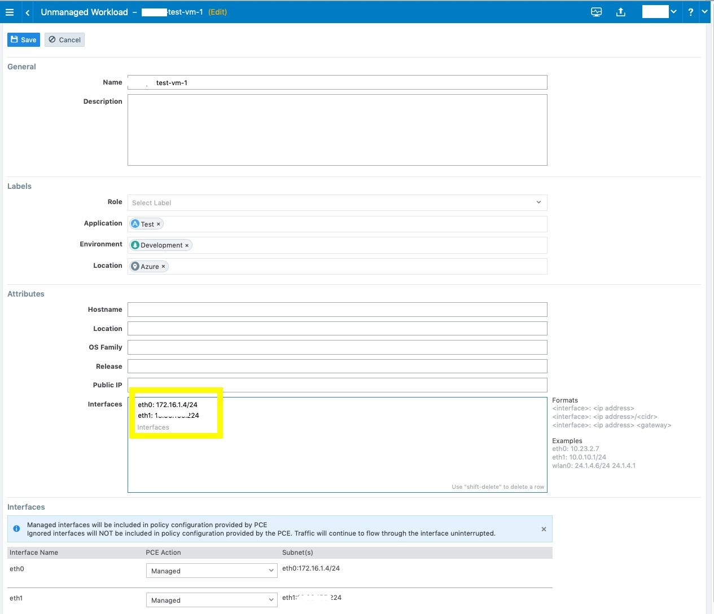
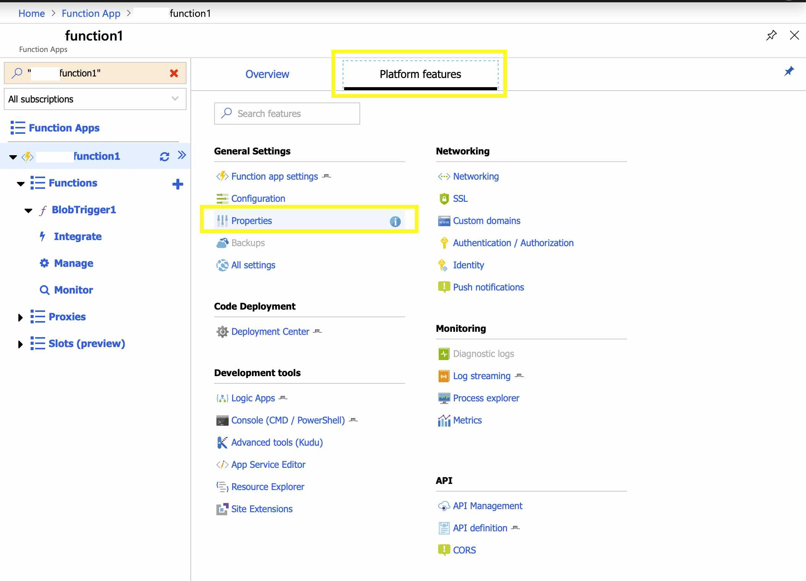
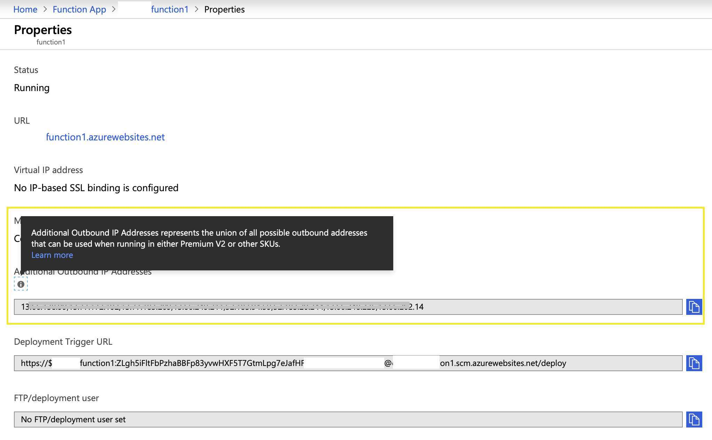
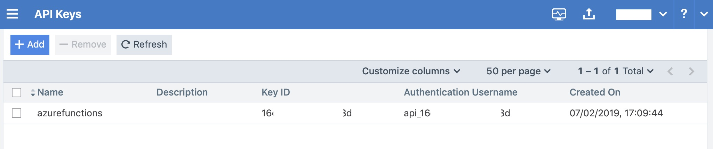
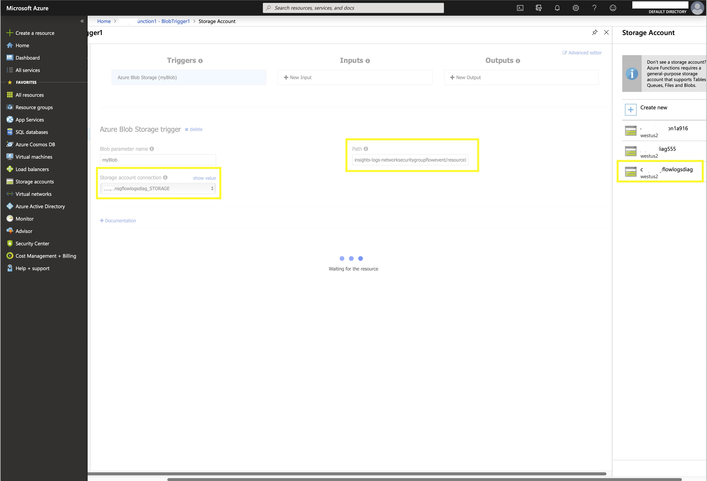
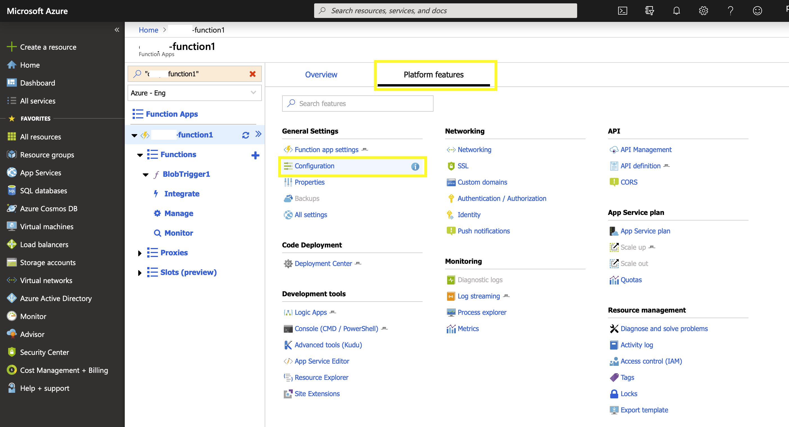
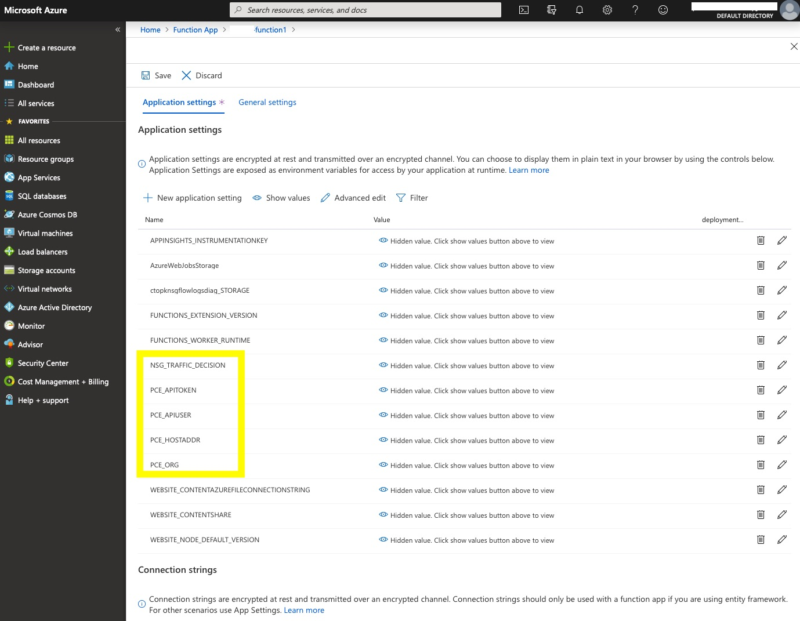
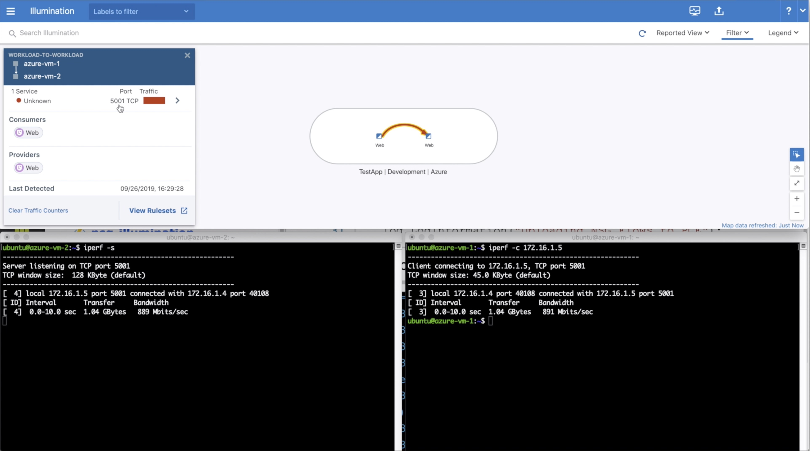

# Installation instructions

## PCE Steps

  * On PCE, create unmanaged workloads for all the Azure VM's as shown below:
     
  * Make sure that the public IP address for the VM is added as an additional interface, for example in above image the public IP is added as eth1:\<Public IP here\>.
  * Now please make sure PCE is accessible from Azure IP range using following steps:
     * Click on the "function name" , then click "platform features" and then finally click "properties" as shown in the image below:
        
     * Now on the properties page, note down the "additional outbound IP Address" as shown below:
        
     * Please make sure PCE is accessible from these IP addresses noted down above.
     * Finally if you need to open up IPs for broader Azure services, here is the list for them: https://devblogs.microsoft.com/devops/new-ip-firewall-rules-for-azure-devops/
  * Now create new API key for azure functions as shown below and store it locally temporarily since it is not shown again:
     

## Azure NSG Flow Logs Steps

 1. Log in to Azure portal and turn on NSG Flow logging for the VM's/Networks which are to be visualized in PCE.
 1. The steps for doing it are listed here: https://docs.microsoft.com/en-us/azure/network-watcher/network-watcher-nsg-flow-logging-portal
 1. Once NSG flow logs are enabled test it by downloading them as shown here: https://docs.microsoft.com/en-us/azure/network-watcher/network-watcher-nsg-flow-logging-portal#download-flow-log
 1. If the download section doesn't show the json log files, please repeat step 2 to see if NSG flow logs are enabled correctly.
 1. Now note down the log path in the download section, it should be something like shown below, please store it, since we are going to need it in Azure Function Creation section below.
    ```
    insights-logs-networksecuritygroupflowevent/resourceId=/SUBSCRIPTIONS/{subscriptionID}/RESOURCEGROUPS/{resourceGroupName}/PROVIDERS/MICROSOFT.NETWORK/NETWORKSECURITYGROUPS/{nsgName}/y={year}/m={month}/d={day}/h={hour}/m=00/macAddress={macAddress}/PT1H.json
    ```
 
 ## Azure Function Creation
 
   1. Now, log into Azure Portal and follow the step by step instructions only in "Create an Azure Function app" section to create a Blob triggered Azure function: https://docs.microsoft.com/en-us/azure/azure-functions/functions-create-storage-blob-triggered-function#create-an-azure-function-app
   1. The function has to be in the same Availability zone as that of NSG Log flows storage account created in above section.
   1. Once the function is created, follow following steps to connect NSG flow logs storage to the function:
       1. Click __Integrate__ below the function and click on the __myBlob__ trigger as shown in image below:
            
       1. Now click the __Storage Account Connection__ and see if __NSG Flow log storage__ is shown there. If it doesn't show up, click on the __New__ button and try to add the storage account as shown in image above.
       1. If the storage account section shown above doesn't have the storage account for NSG flow listed there, it means you have created the function in different availability zone and thus you will have to repeat the steps above to before proceeding to create the function in same availability zone.
       1. Now once you have connected the storage account for NSG Flow logs with this functions, let us set the Path (highlighted in yellow in above image) to the one listed in step 5 in above __Azure NSG Flow Logs Steps__ section or as shown in the next step below:
           ```
           insights-logs-networksecuritygroupflowevent/resourceId=/SUBSCRIPTIONS/{subscriptionID}/RESOURCEGROUPS/{resourceGroupName}/PROVIDERS/MICROSOFT.NETWORK/NETWORKSECURITYGROUPS/{nsgName}/y={year}/m={month}/d={day}/h={hour}/m=00/macAddress={macAddress}/PT1H.json
           ```
       1. Now still on the function __Integrate__ page click on the __advanced editor__ link in top corner and check if the settings look somewhat similar to the one listed in [src/function.json](src/function.json) file.
       1. If they look same, we are all set now from storage point of view.
   1. Once storage is set, let us set the PCE environment variables for the functions.
       1. Click on the function itself and click platform as shown in the image below:
            
       1. Now click configuration and configuration page will show up.
       1. Now follow the steps mentioned in __Application setting__ section on this page https://docs.microsoft.com/en-us/azure/azure-functions/functions-how-to-use-azure-function-app-settings#settings and set the following highlighted PCE and NSG variables from first section above:
            
       1. Make sure the PCE_HOSTADDR is set as https://\<PCE-host\>:\<PCE-port\>/
       1. For example, https://illumio-test-pce-1.illumio.com:8443/
       1. The values for NSG_TRAFFIC_DECISION are __all__, __allowed__ or __denied__.
       1. The default value for NSG_TRAFFIC_DECISION is __allowed__ if the variable is empty string, not set, or a typo.
       1. Once the variables are set, we can proceed to next steps.
   1. Now click on the __BlobTrigger1__ function itself and an editor will open up with a single run() function in it.
   1. Remove the the code there and replace it with the one in the [src/run.csx](src/run.csx) file.
   1. Once the above code is pasted in the editor, Click __Save__ and then __Run__ and then open the __Log__ section below to see if the function has started.
   1. You will see in the log that the function is being triggered (it can take few minutes for initial run, but then it is fast after that) and the log shows how many flows were uploaded to PCE as shown below:
       ```
       2019-07-03T21:29:56.639 [Information] Executing 'Functions.BlobTrigger1' (Reason='New blob detected: insights-logs-networksecuritygroupflowevent/resourceId=/SUBSCRIPTIONS/<snip>/RESOURCEGROUPS/<snip>/PROVIDERS/MICROSOFT.NETWORK/NETWORKSECURITYGROUPS/<snip>/y=2019/m=07/d=03/h=21/m=00/macAddress=<snip>/PT1H.json', Id=<snip>)
       2019-07-03T21:29:56.639 [Information] Uploading NSG Flows to PCE
       2019-07-03T21:29:56.869 [Information] Created
       2019-07-03T21:29:56.869 [Information] {"num_flows_received":68,"num_flows_failed":0,"failed_flows":[]}
       2019-07-03T21:29:56.869 [Information] Uploaded flow to: https://<snip>:8443/api/v2/orgs/<snip>/agents/bulk_traffic_flows
       2019-07-03T21:29:56.869 [Information] Executed 'Functions.BlobTrigger1' (Succeeded, Id=<snip>)
       ```
   1. Thats it, you have a working Azure function which uploads NSG Flow logs to PCE for visualization as shown below:
       
