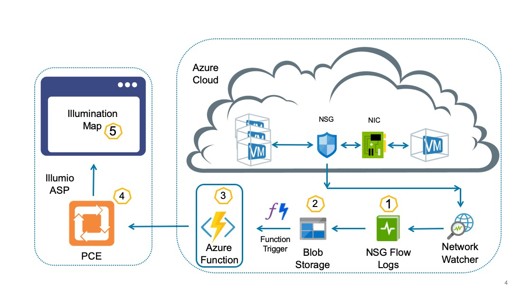

# Azure Function for Illuminating Azure NSG Flow Logs

The main goal here is to visualize Azure NSG Flow Logs on PCE Illumination Map.

# Architecture Diagram

## Installation

Detailed instructions on how to install, configure, and get the project running are mentioned in [INSTALL](INSTALL.md) document.

## Contributing

Instructions on how to contribute:  [CONTRIBUTING](CONTRIBUTING.md).

## Links

1. Turning ON NSG Flow logging: https://docs.microsoft.com/en-us/azure/network-watcher/network-watcher-nsg-flow-logging-portal
1. Azure Blob storage triggered function: https://docs.microsoft.com/en-us/azure/azure-functions/functions-create-storage-blob-triggered-function#create-an-azure-function-app
1. Azure Services IP Address List: https://devblogs.microsoft.com/devops/new-ip-firewall-rules-for-azure-devops
1. NSG Flow Logs Prerequisites: https://github.com/MicrosoftDocs/azure-docs/issues/29446#issuecomment-485329927
